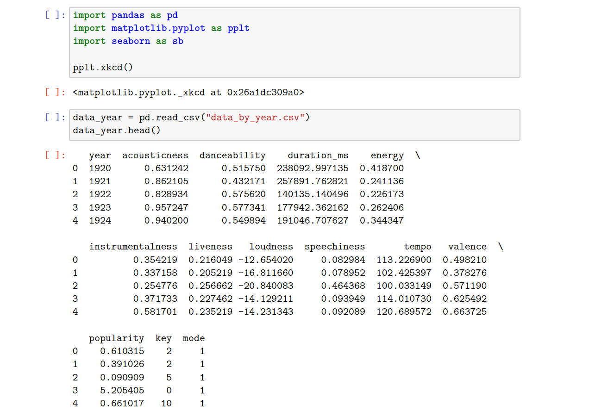
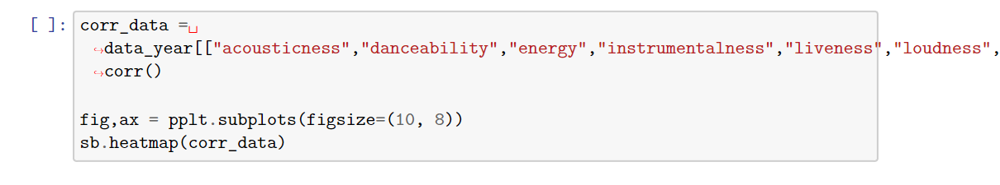
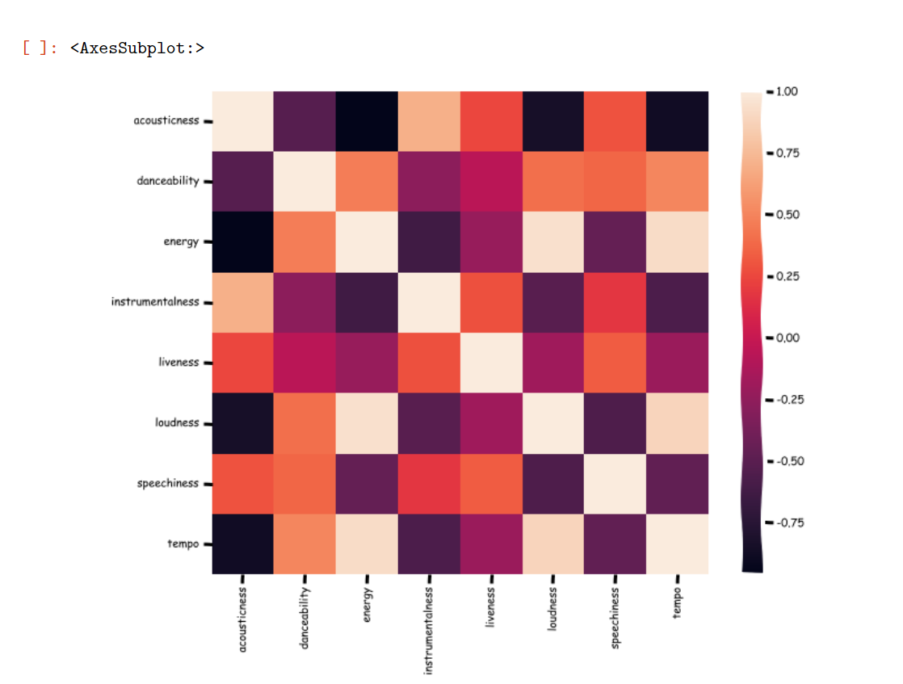
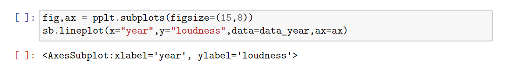
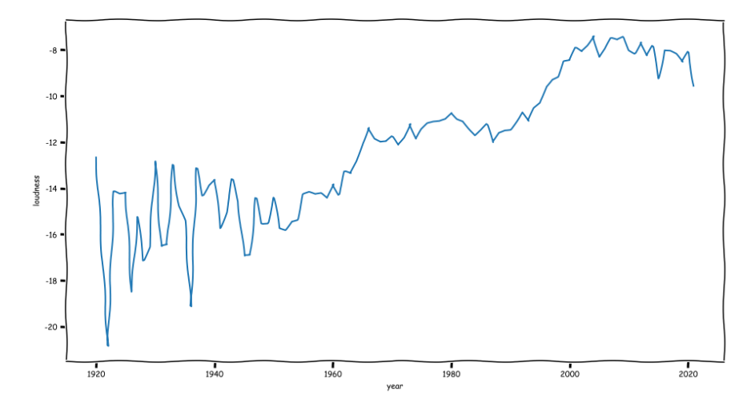
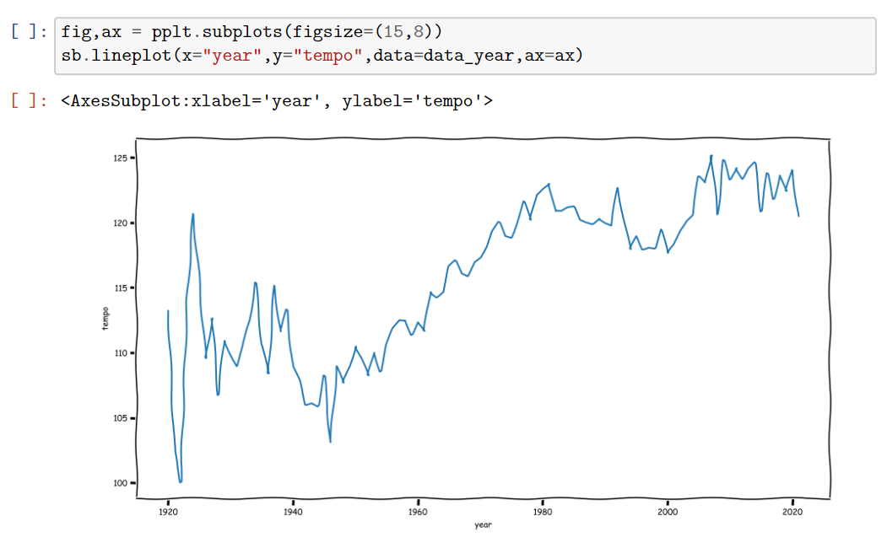
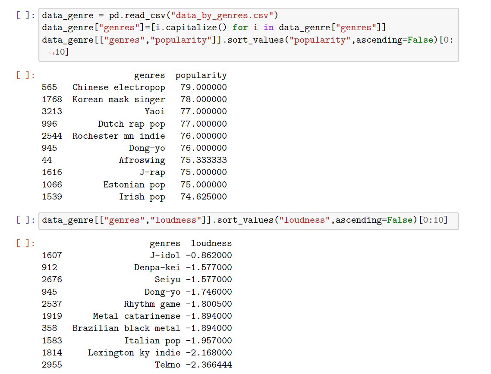
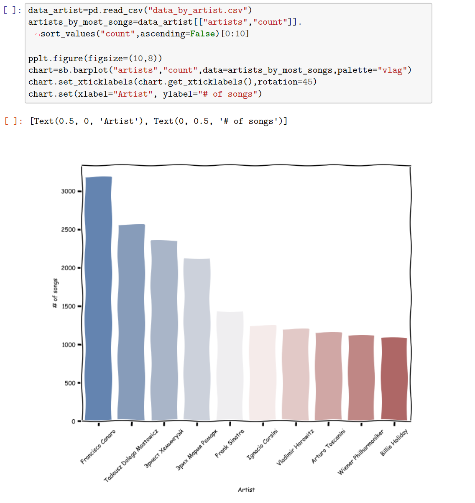
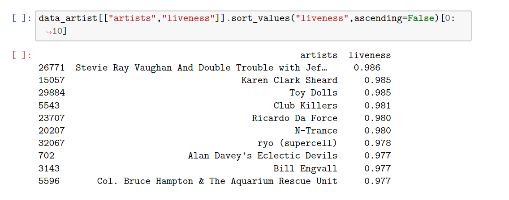

## Analyzing a Spotify dataset using Pandas in Python
 
For this project, I will be analyzing a Spotify dataset (which can be found in my Github repository for this project) that carries various information on artists’ songs from 1920-2021. The whole file has multiple datasets, but I have chosen three datasets to analyze — “data_by_year”, “data_by_genre”, and “data_by_artist”. So, how exactly have songs changed over the years? What's the most popular genre on Spotify? Let’s find all of this out and more.
 

### <b>Analyzing the “data_by_year” dataset</b>

#### Import and Clean Data
 

First, I will import the libraries that will be needed in the whole data analysis process. In addition to Pandas, I will use the Seaborn library for data visualization.

 

No cleaning needed for this dataset, we import and the fun begins.

#### Exploration and Data Visualization

##### Correlations between features of music
 

We can start off our analysis by finding the correlation between the different music features.

 

As you can see above, some of the more correlated features are: loudness and energy, acousticness and instrumentalness, and energy and danceability. Loudness/energy and energy/danceability are self explanatory, but it's interesting to note that the more acoustic a song tends to be, the more instrumentalness (amount of vocals) it has. Definitely need the vocals to shine more when there's less instruments to hide them behind!
 

##### Observing changes in trends over time
So, how has music been changing over time? We can answer this by observing the trends in the music features over the years.

 

In accordance with the trend known as the loudness wars, we can see that the loudness of songs has continuously trended upward since the 1950s. Interestingly enough, loudness reached its' peak circa 2010, and has since steadily been declining to 90s levels. Music constantly goes through phases in order to remain fresh sounding on the ears, so its' no surprise that after reaching what might perhaps be the "loudness limit" humans can take from their songs, it started trending downward rather than stagnating at the peak.

 
Observing the tempo changes over time, we can see that music has gotten significantly faster over the years, but, in a similar fashion to loudness, peaked around 2010, with the trend slowly reversing since then.

### <b>Analyzing the “data_by_genre” dataset</b>

#### Exploration

##### Comparing different genres
 

Next, we can analyze the various different music genres and see how they compare with each other. As you can see below, the most popular genre according to Spotify's metric "popularity" (According to Spotify, “popularity is calculated by an algorithm and is based, in the most part, on the total number of plays the track has had and how recent those plays are) is Chinese electropop! Definitely a surprise, but it only makes sense for the country with the highest population in the world to have a very popular genre.
We can also notice the loudest genres on Spotify, which is shown to be J-idol, a type of Japanese pop music. And no surprise that a black metal genre gets in the top 10 for loudness as well!

 

### <b>Analyzing the “data_by_artist” dataset</b>

#### Exploration and Data Visualization

##### Comparing the many artists on Spotify
 

Finally, we can analyze our final dataset, which contains all of the many different artists found on Spotify. So, which artist has the most amount of work on Spotify? Well, none other than Francisco Cannaro, a Uruguayan violinist who has over 3000 songs published on Spotify! The well known Frank Sinatra comes in at number 5.

 

Well, it's one thing to have the most amount of songs published on Spotify, but it's another to have the highest rate of "liveness" (which according to Spotify, describes the probability that the song was recorded with a live audience). Only the most talented of artists can get away with this, and coming in at the top is the band Stevie Ray Vaughan And Double Trouble.

 

### <b>Summary</b>

